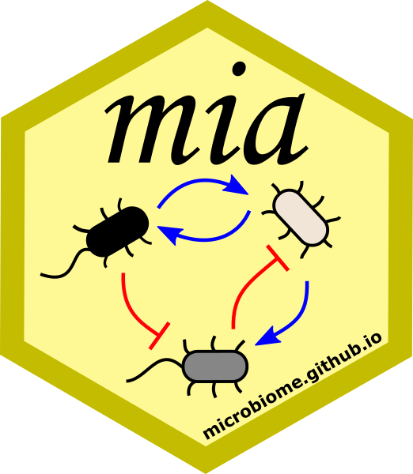

# Microbiome data simulation with miaSim 

## miaSim

This R/Bioconductor package provides tools to simulate (longitudinal)
time series data from popular models in microbial ecology. The
[homepage](https://microbiome.github.io/miaSim/) provides tutorials and
references for the [implemented
models](https://microbiome.github.io/miaSim/reference/index.html):

- Self-organised instability (SOI)
- Hubbell’s neutral model
- generalized Lotka-Volterra (gLV)
- Ricker model (discrete gLV)
- Stochastic logistic model
- Consumer-resource model

These methods can be used for *in silico* studies of microbial community
dynamics or multi-omic or host-microbiome interactions. The miaSim
package supports the Bioconductor [multi-assay data science
framework](https://microbiome.github.io/OMA) for multi-omic data
integration and time series analysis, and utilizes the
`(Tree)SummarizedExperiment` data container.

[Getting
started](https://microbiome.github.io/miaSim/articles/miaSim.html).

### miaSimShiny

The accompanying
[miaSimShiny](https://github.com/gaoyu19920914/miaSimShiny) package
allows users to explore the parameter space of their models in real-time
in an intuitive graphical interface.

You can experiment with miaSimShiny
[online](https://gaoyu.shinyapps.io/shiny_rep/).

### Contributions and acknowledgments

You can find us online from
[Gitter](https://gitter.im/microbiome/miaverse).

Contributions are very welcome through issues and pull requests at the
[development site](https://github.com/microbiome/miaSim). We follow a
git flow kind of approach. Development version should be done against
the `main` branch and then merged to `release` for release.
(<https://guides.github.com/introduction/flow/>)

We are grateful to all
[contributors](https://github.com/microbiome/miaSim/graphs/contributors).

This research has received funding from

- the Horizon 2020 Programme of the European Union within the
  [FindingPheno project](https://www.findingpheno.eu/) under grant
  agreement No 952914.
- Research Council of Finland (grant 330887)

### Citing the package

**Kindly cite this work** as follows:

Gao *et al.* (2023). Methods in Ecology and Evolution. DOI:
[10.1111/2041-210X.14129](https://doi.org/10.1111/2041-210X.14129)

For citation details, see R command `citation("miaSim")`.

**Code of conduct** Please note that the project is released with a
[Bioconductor Code of
Conduct](https://bioconductor.github.io/bioc_coc_multilingual/). By
contributing to this project, you agree to abide by its terms.
